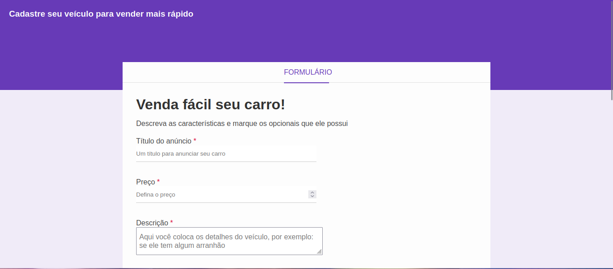

# Car Sales Form Project

This project is a web application designed to facilitate the sale of vehicles. It features a comprehensive form that allows users to register their cars for sale, including details such as title, price, description, brand, model, mileage, purchase date, gear type, and optional features.

## Technologies Used

- **HTML5**: Used for structuring the content and the form elements.
- **CSS3**: Used for styling the application, ensuring a clean and user-friendly interface.

## Project Structure

The project file structure is organized as follows:

```text
.
├── assets
│   └── css
│       └── styles.css
├── index.html
└── README.md
```

## How to Run

To run this project locally, follow these steps:

1. **Clone the repository**:

   ```bash
   git clone https://github.com/alexandrerogeriosn93/project-html-css-form-sales-car.git
   ```

2. **Navigate to the project directory**:

   ```bash
   cd project-html-css-form-sales-car
   ```

3. **Open the file**:
   Locate the `index.html` file in the root directory and open it with your preferred web browser (e.g., Chrome, Firefox, Edge).

## Preview

Below is a preview of the application:


